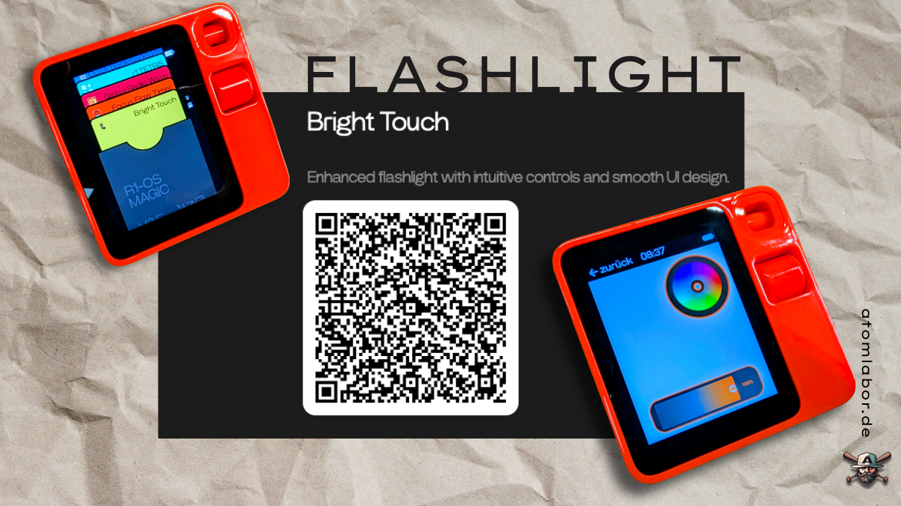

  

# R1-Flashlight 🔦

*Flashlight for Rabbit R1 (V1.1)*

[🇩🇪 Deutsche Version](#deutsche-version) | [🇺🇸 English Version](#english-version)

---

## Deutsche Version

### Projektbeschreibung

R1-Flashlight ist eine speziell für das Rabbit R1 entwickelte Taschenlampen-Anwendung, die eine intuitive und funktionsreiche Beleuchtungslösung bietet. Die App nutzt die einzigartigen Eingabemöglichkeiten des R1-Geräts optimal aus.

### Funktionsweise

#### 🌟 Hauptfunktionen:
- **Helligkeitsregelung**: Dimmen der Taschenlampe per Scrollrad
- **Farbauswahl**: Öffnung des Farbrads durch PTT-Taste (Push-to-Talk)
- **Farbwechsel**: Intuitive Auswahl verschiedener Farben über das Farbrad
- **Reset-Funktion**: Zurücksetzen auf Standardwerte durch langes Drücken der PTT-Taste

#### 🎮 Bedienung:
1. **Scrollrad**: Drehen zum Anpassen der Helligkeit
2. **PTT kurz drücken**: Farbrad öffnen/schließen
3. **PTT lang drücken**: App auf Standardeinstellungen zurücksetzen

### Installation

1. Laden Sie die App direkt über den [Live-Demo-Link](https://atomlabor.github.io/R1-Flashlight/) auf Ihr Rabbit R1
2. Alternativ können Sie den Code aus diesem Repository verwenden

### Technische Details

- **Sprachen**: JavaScript (62.1%), CSS (13.2%), Shell (12.8%), HTML (11.9%)
- **Kompatibilität**: Optimiert für Rabbit R1
- **Version**: 1.1

### Links

- 🌐 **Live Demo**: [atomlabor.github.io/R1-Flashlight/](https://atomlabor.github.io/R1-Flashlight/)
- 🏢 **Entwickler**: [atomlabor.de](https://atomlabor.de)
- 🐰 **Bright Touch Creations**: [rabbit.tech Bright Touch](https://www.rabbit.tech/share_creation?url=https%3A%2F%2Frough-black-gayal.intern.rabbitos.app%2Fapps%2Fapp%2Fdist%2Findex.html&title=Bright%20Touch&description=Enhanced%20flashlight%20with%20intuitive%20controls%20and%20smooth%20UI%20design.&iconUrl=https%3A%2F%2Frough-black-gayal.intern.rabbitos.app%2Fapps%2Fapp%2Fdist%2Ficon.png&screenshotUrl=https%3A%2F%2Frough-black-gayal.intern.rabbitos.app%2Fapps%2Fapp%2Fdist%2Fscreenshot.jpg&themeColor=0xFFF5D547)

### Lizenz

Dieses Projekt steht unter einer Open-Source-Lizenz. Beiträge sind willkommen!

---

## English Version

### Project Description

R1-Flashlight is a flashlight application specifically developed for the Rabbit R1, providing an intuitive and feature-rich lighting solution. The app optimally utilizes the unique input capabilities of the R1 device.

### How it Works

#### 🌟 Main Features:
- **Brightness Control**: Dim the flashlight using the scroll wheel
- **Color Selection**: Open color wheel via PTT button (Push-to-Talk)
- **Color Change**: Intuitive selection of different colors through the color wheel
- **Reset Function**: Reset to default values by long-pressing the PTT button

#### 🎮 Controls:
1. **Scroll Wheel**: Rotate to adjust brightness
2. **PTT Short Press**: Open/close color wheel
3. **PTT Long Press**: Reset app to default settings

### Installation

1. Load the app directly via the [Live Demo Link](https://atomlabor.github.io/R1-Flashlight/) onto your Rabbit R1
2. Alternatively, you can use the code from this repository

### Technical Details

- **Languages**: JavaScript (62.1%), CSS (13.2%), Shell (12.8%), HTML (11.9%)
- **Compatibility**: Optimized for Rabbit R1
- **Version**: 1.1

### Links

- 🌐 **Live Demo**: [atomlabor.github.io/R1-Flashlight/](https://atomlabor.github.io/R1-Flashlight/)
- 🏢 **Developer**: [atomlabor.de](https://atomlabor.de)
- 🐰 **Bright Touch Creations**: [rabbit.tech Bright Touch](https://www.rabbit.tech/share_creation?url=https%3A%2F%2Frough-black-gayal.intern.rabbitos.app%2Fapps%2Fapp%2Fdist%2Findex.html&title=Bright%20Touch&description=Enhanced%20flashlight%20with%20intuitive%20controls%20and%20smooth%20UI%20design.&iconUrl=https%3A%2F%2Frough-black-gayal.intern.rabbitos.app%2Fapps%2Fapp%2Fdist%2Ficon.png&screenshotUrl=https%3A%2F%2Frough-black-gayal.intern.rabbitos.app%2Fapps%2Fapp%2Fdist%2Fscreenshot.jpg&themeColor=0xFFF5D547)

### Contributing

Contributions are welcome! Please feel free to submit issues or pull requests.

### License

This project is open source. Contributions are welcome!

## Screenshots / Screenshots

Screenshots coming soon / Screenshots kommen bald

## Support / Unterstützung

For questions or support, please visit [atomlabor.de](https://atomlabor.de) or create an issue in this repository.

Bei Fragen oder Support besuchen Sie [atomlabor.de](https://atomlabor.de) oder erstellen Sie ein Issue in diesem Repository.

*Made with ❤️ by [atomlabor](https://atomlabor.de) for the Rabbit R1 community*
